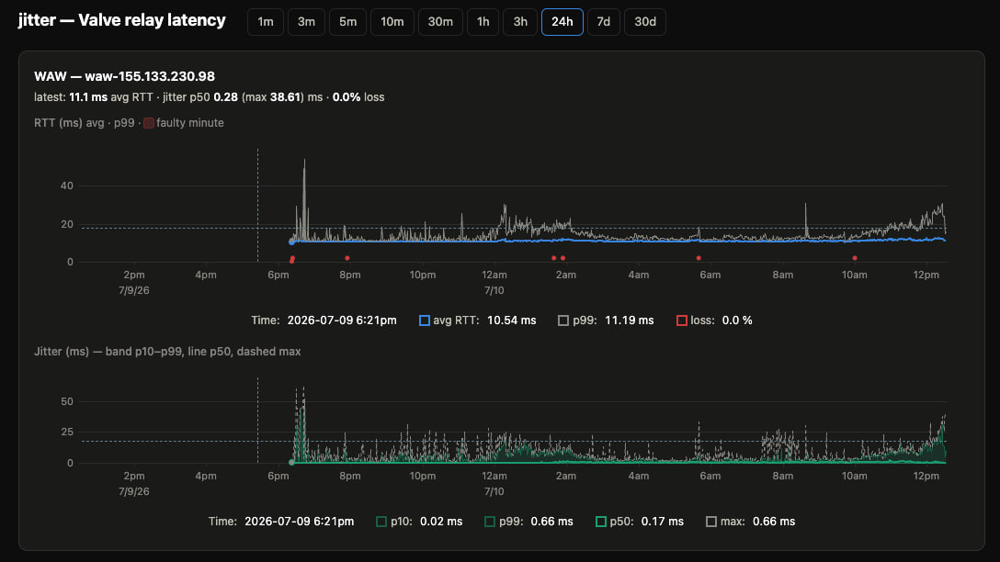
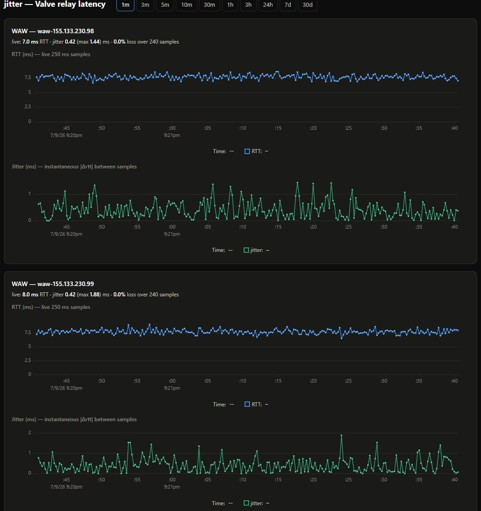

# jitter

> [!WARNING]
> Claude-coded, in-development proof-of-concept.

Continuously measures RTT, jitter, and packet loss from your network to the
Valve SDR relays that carry CS2 matchmaking traffic — so you can see *when*
your connection degrades and whether it's one Valve path or your whole link.

**Why jitter?** For smooth play, jitter (variation in latency) usually matters
more than raw ping. CS2's servers and client-side interpolation / lag
compensation absorb a *stable* latency, but they can't hide latency that keeps
changing — that's what surfaces as stutter, rubber-banding, and inconsistent
hit registration. A steady 60 ms plays better than an erratic 20 ms.

## How it measures

CS2 traffic enters Valve's network at an SDR relay POP (Warsaw, Frankfurt,
Vienna, …). This tool fetches Valve's public relay list
(`ISteamApps/GetSDRConfig`) and sends an ICMP echo to a few relays every
250 ms. Per minute, per target, it stores min/avg/max/p50/p95/p99 RTT, the
distribution of successive-RTT differences (jitter p10/p50/p99/max — the
p99/max are the lag-spike signal, since jitter *variation* is what causes
in-game stutter), and loss % in SQLite, and serves a dashboard at `:8080`.
Jitter is computed in true send order (each probe carries a sequence number),
and a minute is held open for one probe-timeout so a slow spike sample near a
boundary is still counted. A minute with ≤1 successful sample can't be
measured and is drawn as a red "faulty" band rather than a misleading zero.

ICMP is used because the game's own SDR UDP ping format is not public; the
relays are the same machines on the same path. Add `-extra-targets` (your
router, 1.1.1.1) to tell "Valve path" problems apart from "my link" problems.

## Examples

A 24-hour history with jitter spikes and rising instability — **not a playable
connection** (the kind of pattern this tool exists to catch):



A live 1-minute view of steady, low-jitter links that **play fine** (sub-1 ms
jitter, no loss):



## Dashboard

The range buttons span `1m … 30d`. Ranges of 10 minutes or less show the raw
250 ms samples (a live close-up that refreshes every couple of seconds — useful
while playing); longer ranges show per-minute aggregates. The selected range is
kept in the URL hash (e.g. `#3m`) so it survives reload and is shareable.

## Run (Docker)

Compose (pulls the prebuilt image from GHCR):

```bash
docker compose up -d
# dashboard at http://<host>:8080
```

Or without compose, one line:

```bash
docker run -d --name jitter -p 8080:8080 -v jitter-data:/data ghcr.io/ignatella/cs2-jitter:latest
```

## Run (bare)

```bash
go run ./cmd/jitter -pops waw,fra,vie -extra-targets 192.168.1.1
```

## Quick relay check

```bash
go run ./cmd/relaycheck --pops waw,fra,vie,sto,ams
```

## Configuration

Every flag also reads env `JITTER_<FLAG>` (dashes → underscores); flags win.

| Flag | Default | Meaning |
|---|---|---|
| `-pops` | `waw,fra,vie` | SDR POP codes to probe |
| `-relays-per-pop` | `2` | relays probed per POP |
| `-interval` | `250ms` | probe cadence per target |
| `-timeout` | `1s` | reply timeout (counts as loss) |
| `-db` | `./jitter.db` | SQLite path (`/data/jitter.db` in Docker) |
| `-listen` | `:8080` | HTTP listen address |
| `-retention-days` | `90` | history retention |
| `-icmp-privileged` | `false` | raw ICMP socket (needs CAP_NET_RAW) |
| `-extra-targets` | — | extra IPs probed identically (router, 1.1.1.1) |

## Development

Open in the dev container (VS Code: "Reopen in Container") — it includes Go
and allows unprivileged ICMP. Then:

```bash
go test ./...
go run ./cmd/relaycheck
```

Design spec: `docs/superpowers/specs/2026-07-09-jitter-monitor-design.md`.
